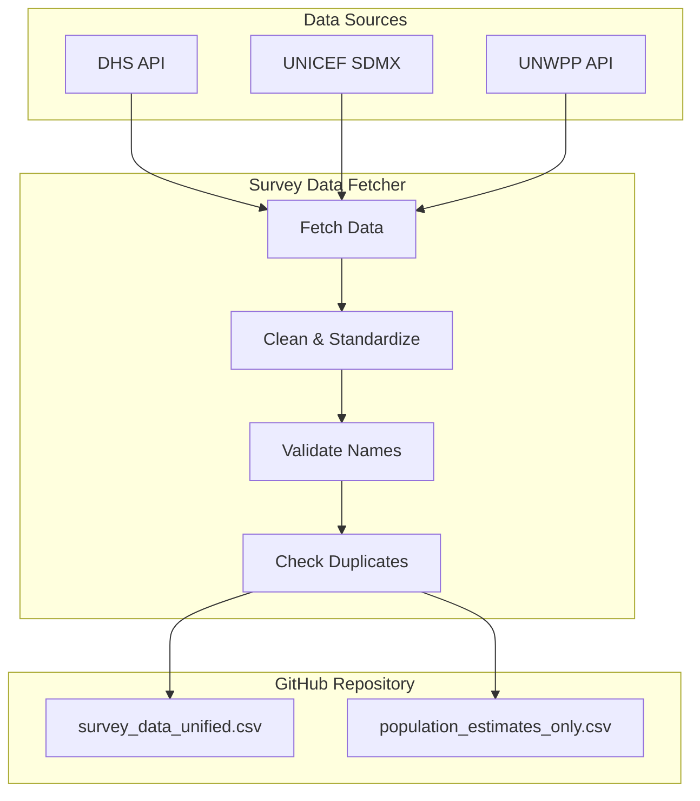

# FASTR Survey Data Fetcher

A Shiny application for fetching, cleaning, and integrating health survey data from multiple international sources into the FASTR Analytics Platform.

## Key Features

- **Multi-Source Data Fetching**: Connect to DHS, UNICEF (MICS/WUENIC), and UN World Population Prospects APIs
- **Data Cleaning & Standardization**: Automatically clean and standardize data for FASTR compatibility
- **Manual Data Entry**: Enter survey values manually with enforced standard indicator codes
- **Data Review**: Compare fetched data against existing database with visual overlays
- **GitHub Integration**: Pull the latest database, validate new data, and push updates directly to GitHub
- **Collaborative Workflow**: Multiple users can contribute to the unified survey database

## Architecture

## Data Flow

1. **Fetch** - Select data source, indicators, and countries (or use Manual Entry)
2. **Clean** - Apply FASTR standardization to harmonize names and formats
3. **Review** - Compare fetched data against existing database visually
4. **Validate** - Check admin area names against existing database
5. **Deduplicate** - Identify records that already exist, choose to keep or replace
6. **Push** - Append new records to GitHub repository

## Output Databases

| Database | Contents | Indicators |
|----------|----------|------------|
| `survey_data_unified.csv` | Survey indicators | anc1, penta1, bcg, measles1, u5mr, etc. |
| `population_estimates_only.csv` | Population estimates | poptot, livebirth, womenrepage, etc. |

## Quick Links

- [Getting Started](getting-started.md) - Set up and run the app
- [Data Sources](data-sources.md) - Available APIs and their indicators
- [Database Integration](database-integration.md) - GitHub sync workflow
- [Deployment](deployment.md) - Deploy to Hugging Face Spaces
